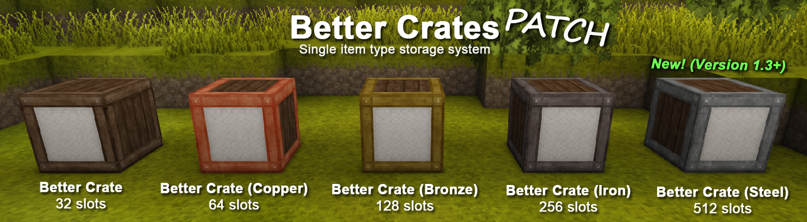

# BetterCratesPatch

is a mod that introduces a new storage block with a new mechanic for [*Vintage Story*][VS]. These "Better Crates" can only store one type of item but they store much more of it than a wooden chest.

[VS]: https://www.vintagestory.at/

## Download / Installation

Available right here through [GitHub Releases][DL].

To install, start the game and go to the *Mod Manager* in the main menu. There you can find a button labeled *Open Mod Folder* that will open said folder in your file explorer. Simply copy the `.zip` file you downloaded into here **without extracting it**.

[DL]: https://github.com/elocrypt/BetterCratesPatch/releases

## Features / Usage

- No GUI element but instead shows the item model with quantity on the label.
- Interact by left clicking to take items out and right clicking to insert items. They can only be broken with an axe.
- Upgradable to the next tier by using an upgrade item on them, no need to put into crafting window to upgrade.
- Fully multiplayer compatible. Including claim protected, reinforcement and locking mechanic.
- Compatible with hoppers and chutes. Bottom side is the output. All other sides can be inserted into.
- Rotates when placed. Can also be placed into the floor to face up or ceiling to face down.
- Detailed Handbook information with links to each new block/item. Just search for "Better Crate".
- Reactive block interaction overlay information.
- Compatible with [Carry On][CO] mod. Highly recommended! *Note: Crates can only be carried by hand.*

[CO]: https://mods.vintagestory.at/carryon

## Changelog

**Update 11-22-24: new version 1.7.2 compatible with VS 1.20.0-pre13**
- Recompiled for VS 1.20.0-pre13 to verify compatibility.

**Patch:** [Better Crates Patch][BCP]

*This update was made with permission from the original [author][A]. Continued original versioning for simplicity.*
##
**Update 5-6-24: new version 1.7.1 compatible with VS 1.19.7**

- Recompiled for VS 1.19.7 to verify compatibility.
- Added [Vanilla Variants][VV] chests to the recipes to make a Better Crate.

**Original Mod:** [Better Crates][BC]

*Note from original [author][A]:*

*I do not have much time nowadays to thoroughly test things so please be sure to backup your worlds before updating to any new version of Vintage Story, can't stress that enough. Very important when updating as many modders won't immediately know if their mod becomes incompatible with new versions of VS.*

[BC]: https://mods.vintagestory.at/show/mod/146
[BCP]: https://mods.vintagestory.at/bettercratespatch
[VV]: https://mods.vintagestory.at/vanvar
[A]: https://www.vintagestory.at/profile/15465-dauron/?tab=activity
## Known Issues:

While nearly all blocks/items display correctly, some blocks that have overlays such as soil with grass will display without the grass. This only applies to creative mode as you can't have those blocks in survival. There is always the possibility with mods and newer game versions that new blocks/items may not display correctly.
Very rarely when broken the label quantity text will not get destroyed. This seems to only happen in creative mode. This will fix if you restart the game.
Anvil work items in 1.14+ will not display properly. I feel this is a rare case usage and have not devoted time to fixing the issue for now.

### Notes:

As of version 1.4.1 the display range of models and info of the labels can now be configured. Default is 50 block range.
The `BetterCratesConfig.json` file will be in your `VintagestoryData\ModConfig` folder after loading into a world with the mod one time.
This file can be edited with common text editors such as Notepad.
